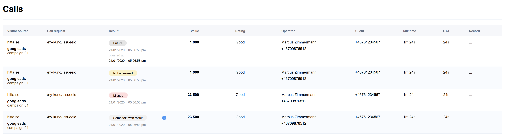

## Test task:

We have an admin panel based on https://github.com/akveo/ngx-admin.

We have a calls component with basic data, we need to design and style it, like in this draft:

but an original idea is appreciated

please clone the repository to your github account and provide a link to the result

## Location

the component:
src/app/pages/dashboard/dashboard.component.ts
the html:
src/app/pages/dashboard/dashboard.component.html
the styles (scss)
src/app/pages/dashboard/dashboard.component.scss

### How to install:

1) git clone https://github.com/Puten/test-task-angular
2) npm install
3) ng serve
now you can have an access on 127.0.0.1:4200/

